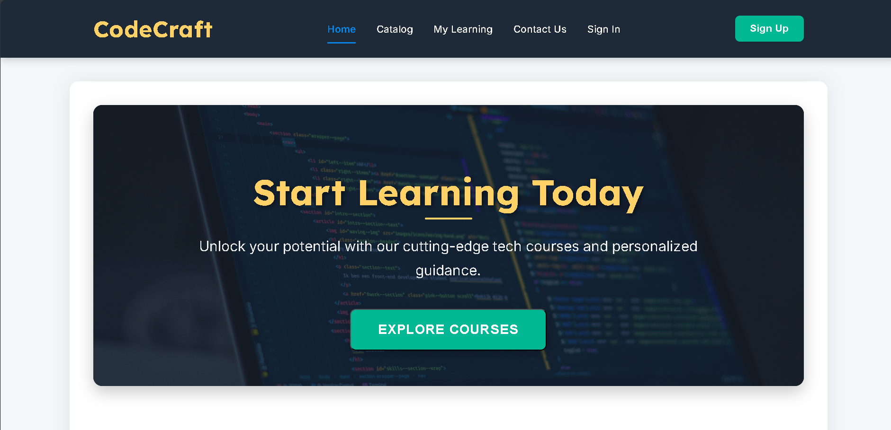
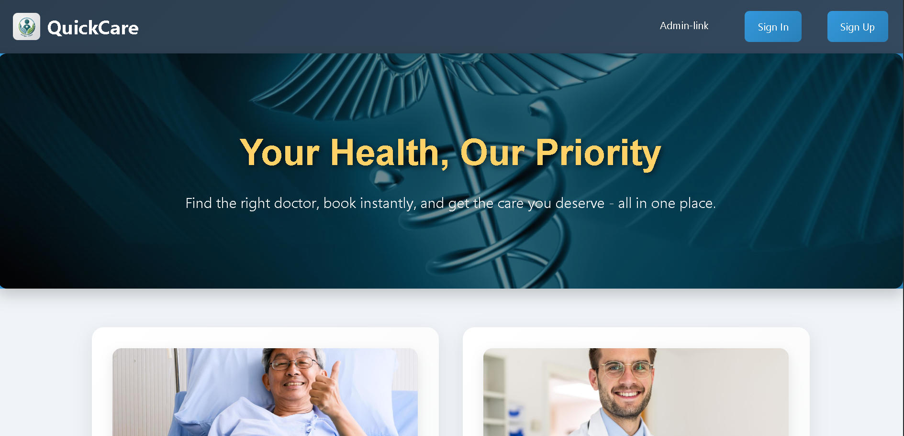
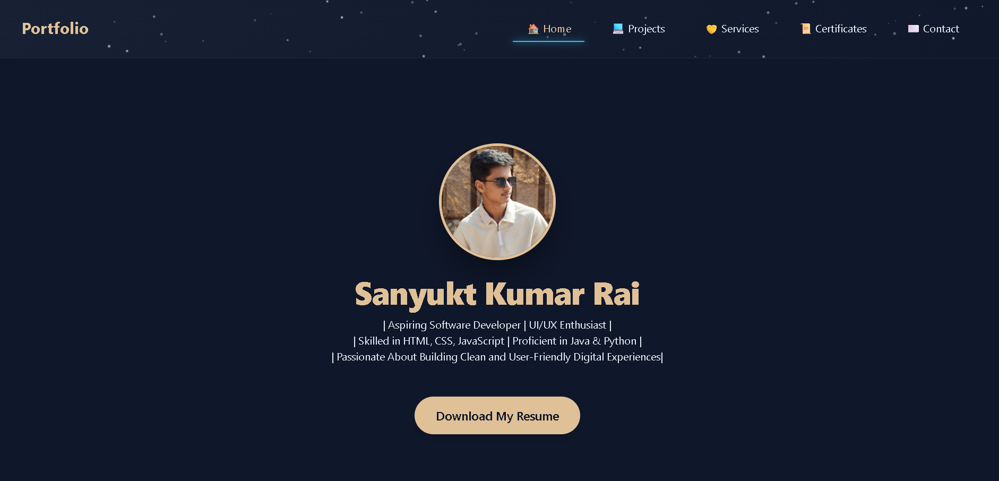

# 🌐 Sanyukt Kumar Rai — Portfolio

Personal portfolio website showcasing my projects, skills, certificates, and developer work.

## ✨ What you'll find

- 👨‍💻 About and developer profile
- 🚀 Featured projects
- 🏆 Certificates and achievements
- 📄 Resume
- 📬 Contact section
- 🎨 Custom responsive UI

## 🖼️ Featured Projects

| Project | Preview |
| --- | --- |
| [CodeCraft](https://github.com/sanyukt63/CodeCraft) | [](https://github.com/sanyukt63/CodeCraft) |
| [Quick-Cure](https://github.com/sanyukt63/Quick-Cure) | [](https://github.com/sanyukt63/Quick-Cure) |
| Portfolio | [](./index.html) |

## 🚀 Run Locally

```bash
git clone https://github.com/sanyukt63/Portfolio-website.git
cd Portfolio-website
```

Open `index.html` in a browser or serve the directory with a local HTTP server.

## 📁 Main Pages

- `index.html` — home
- `projects.html` — projects
- `certificates.html` — certificates
- `contacts.html` — contact
- `services.html` — services

## 📄 Resume

The repository includes a PDF copy of the resume: [CV-Sanyukt Kumar Rai.pdf](./CV-Sanyukt%20Kumar%20Rai.pdf).

## 🤝 Contributing

This is primarily a personal portfolio, but suggestions and improvements are welcome through issues or pull requests.

---

⭐ If you find the portfolio useful or want to follow the project, consider starring the repository.
